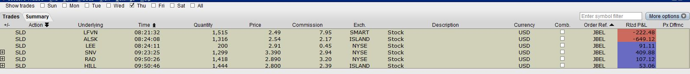

InteractiveBrokerToVectorVestAutomation
=======================================

Interactive Broker To VectorVest Automation

Helps automate trade entry from interactive broker trade window to VectorVest 7.
This app has saved me several hours of my life from the manual data entry I used to make before.

The tool reads a text file located at
C:\VV\Trade.txt

<pre>
<Ignored>	<Trade Type>	<Symbol>	<Trade Date>	<Quantity>	<Price>	<Commission>
</pre>
Trade date does not work on VV7 since it is painful to automate clicking the calendar control. It works for my VV6 automation tool.

Which has to be in the format
<pre>
	SLD	LFVN	08:21:32	1,515	2.49	7.95	SMART	Stock	USD	false	JBEL	-222.48	null
	SLD	ALSK	08:24:08	1,316	2.54	2.17	ISLAND	Stock	USD	false	JBEL	-649.12	null
	SLD	LEE	08:24:11	200	2.91	0.45	NYSE	Stock	USD	false	JBEL	91.11	null
+	SLD	SNV	09:23:25	1,299	3.390	2.94	NYSE	Stock	USD	false	JBEL	409.88	null
+	SLD	RAD	09:50:26	1,418	2.890	3.20	NYSE	Stock	USD	false	JBEL	107.12	null
+	SLD	HILL	09:50:46	1,444	2.800	2.39	ISLAND	Stock	USD	false	JBEL	53.06	null
</pre>

Take a look at the image to setup your trade window.

I keep my executable VV.exe also in the C:\VV folder and Run it as Admin since VectorVest7 runs under admin mode.

Usage:
In VectorVest 7 got to 'Portfolio Manager', select the portfolio you made the trade and then run VV.exe and watch it automatically make all the data entries for you.
The app does often crash the first time so just run it again. 

Now and then VectorVest does change the Title of their application like "VectorVest 7 US - Intraday" or "VectorVest 7 US - Realtime" or "VectorVest 7 - Intraday" which breaks the app. 
You have to adjust the source code to match the title.
const string VectorVestTitle = "VectorVest 7 US - Intraday";
